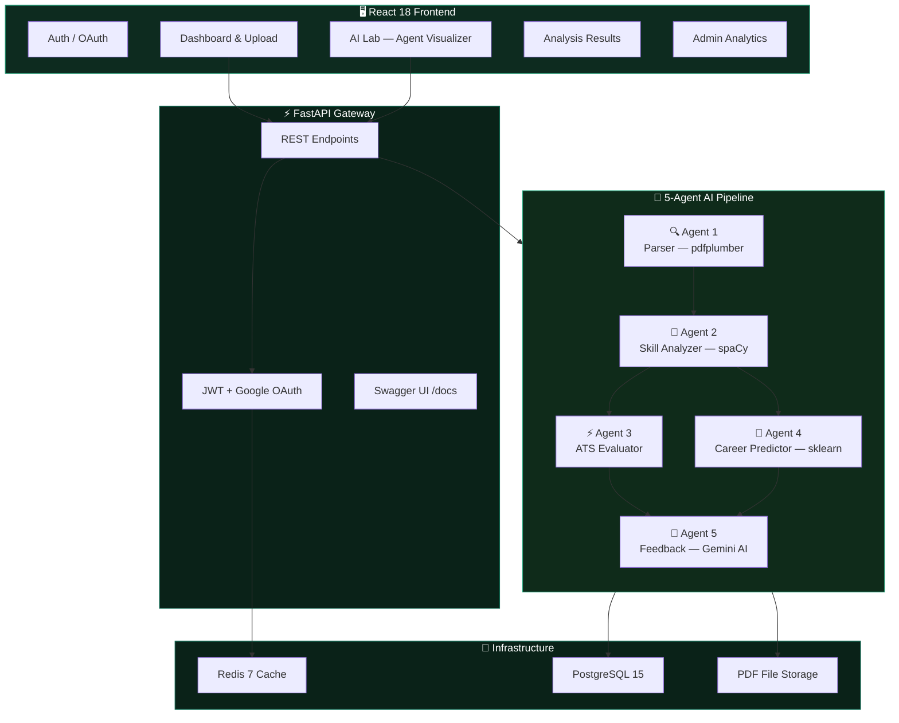

<div align="center">

[](https://git.io/typing-svg)

<br/>


<br/>


<br/>


---

<br/>

## ⚡ What is Smart Resume Analyzer?

**Smart Resume Analyzer** is a production-grade, AI-powered SaaS platform that transforms raw resume PDFs into actionable career intelligence — in under a second.

Unlike rule-based ATS checkers, this platform deploys a **5-agent autonomous pipeline**: each agent is a specialized AI module that observes, reasons, and acts on your resume independently — from PDF parsing to Gemini-powered human feedback.

</div>

<br/>

<div align="center">

| 🤖 **5-Agent AI Pipeline** | 📊 **Deep Resume Intelligence** | 🌐 **Full-Stack SaaS** |
|:---:|:---:|:---:|
| Parallel agents for parsing, scoring, skill analysis, career prediction, and AI feedback — all orchestrated automatically. | ATS score, skill gap analysis, 200+ tech skills detected, career path matching with confidence %, and section-by-section breakdown. | FastAPI REST backend + React 18 dashboard with JWT auth, Google OAuth, admin analytics, and Docker deployment. |


<br/>

<br/>
</div>

<br/>

---

<br/>

## 🏗️ Architecture



<br/>

---

<br/>

## 🤖 The 5-Agent Pipeline

```
┌──────────────────────────────────────────────────────────────────────┐
│                        RESUME PDF UPLOADED                           │
└──────────────────────────────┬───────────────────────────────────────┘
                               │
               ┌───────────────▼────────────────────┐
               │  🔍 AGENT 1 — Parser Agent          │
               │  pdfplumber → raw text extraction   │
               │  Output: {raw_text, sections,        │
               │           word_count, structure}     │
               └───────────────┬────────────────────┘
                               │
               ┌───────────────▼────────────────────┐
               │  🧩 AGENT 2 — Skill Analyzer Agent  │
               │  spaCy NER + 200+ pattern matching  │
               │  Output: {present_skills,            │
               │           missing_skills, gaps}      │
               └──────────┬─────────────┬────────────┘
                          │             │
        ┌─────────────────▼──┐   ┌──────▼──────────────────┐
        │ ⚡ AGENT 3          │   │ 🎯 AGENT 4               │
        │ ATS Evaluator       │   │ Career Predictor         │
        │ 5-dimension scoring │   │ scikit-learn similarity  │
        │ objectives/skills/  │   │ Top 3 roles + confidence │
        │ projects/format/    │   │ Skill gap per career path│
        │ experience          │   │                          │
        └─────────────────┬──┘   └──────┬──────────────────┘
                          │             │
               ┌──────────▼─────────────▼────────────┐
               │  💬 AGENT 5 — Feedback Agent         │
               │  Google Gemini 1.5 Pro               │
               │  Synthesizes all agent results →     │
               │  human-readable summary + top 3      │
               │  actionable improvement suggestions  │
               └───────────────┬────────────────────┘
                               │
               ┌───────────────▼────────────────────┐
               │        SAVED TO POSTGRESQL          │
               │  Score · Skills · Predictions ·     │
               │  Feedback · Pipeline Logs            │
               └────────────────────────────────────┘
```

<br/>

---

<br/>

## ✨ Key Features

<table>
<tr>
<td width="50%">

### 🎯 Resume Intelligence
- **ATS Compatibility Score** (0–100) with breakdown
- Section-by-section quality analysis
- Keyword density heatmap
- Formatting & structure quality check

### 🧠 AI Skill Analysis
- Detects **200+ tech skills** via spaCy NLP
- Skill gap vs. target job descriptions
- Per-skill proficiency scoring
- Recommended learning paths

</td>
<td width="50%">

### 🚀 Career Path Prediction
- Matches resume to **20+ career paths**
- Confidence % per predicted role
- Skill gap to reach target role
- Growth trajectory suggestions

### 📊 Admin Intelligence
- Platform-wide analytics dashboard
- Score distribution histograms
- Monthly upload trends
- Most common skill gaps across all users

</td>
</tr>
</table>

<br/>

---

<br/>

## 📁 Project Structure

```
smart-resume-analyzer/
│
├── 🚀 docker-compose.yml               # Development environment
├── 🚀 docker-compose.prod.yml          # Production overrides
├── 📋 Makefile                         # Developer shortcuts
├── 📦 .env.example                     # Environment template
│
├── 🔧 backend/
│   ├── app/
│   │   ├── agents/                     # 🤖 The 5 AI Agents
│   │   │   ├── base_agent.py           # Abstract base — timing & logging
│   │   │   ├── parser_agent.py         # PDF text extraction (pdfplumber)
│   │   │   ├── skill_analyzer_agent.py # NLP skill detection (spaCy)
│   │   │   ├── ats_evaluator_agent.py  # Resume scoring (5 dimensions)
│   │   │   ├── career_prediction_agent.py # ML career matching (sklearn)
│   │   │   ├── feedback_agent.py       # AI feedback (Google Gemini)
│   │   │   └── pipeline.py             # Agent orchestrator
│   │   │
│   │   ├── routers/                    # API route handlers
│   │   │   ├── auth.py                 # /auth/* — login, register, OAuth
│   │   │   ├── resume.py               # /resume/* — upload, list, delete
│   │   │   ├── analysis.py             # /analysis/* — run, result, history
│   │   │   ├── job.py                  # /job/* — job description submit
│   │   │   └── admin.py                # /admin/* — analytics, users
│   │   │
│   │   ├── models/                     # SQLAlchemy ORM models
│   │   ├── schemas/                    # Pydantic request/response schemas
│   │   ├── services/                   # Business logic layer
│   │   └── utils/                      # Security, file utils, exceptions
│   │
│   ├── alembic/                        # Database migrations
│   ├── scripts/                        # Seed data scripts
│   ├── tests/                          # pytest test suite
│   └── Dockerfile
│
├── 🎨 frontend/
│   ├── src/
│   │   ├── pages/
│   │   │   ├── Login.jsx               # Auth + Google OAuth
│   │   │   ├── Dashboard.jsx           # Upload + score overview
│   │   │   ├── AILab.jsx               # Agent pipeline visualizer
│   │   │   ├── Analysis.jsx            # Detailed results view
│   │   │   └── AdminDashboard.jsx      # Admin analytics
│   │   │
│   │   ├── api/                        # Axios API clients
│   │   ├── store/                      # Zustand state management
│   │   └── components/                 # Reusable UI components
│   │
│   └── Dockerfile
│
└── 🧪 tests/
    ├── test_auth.py                    # Auth endpoint tests
    ├── test_resume.py                  # Resume upload + validation
    └── test_pipeline.py                # Full pipeline integration tests
```

<br/>

---

<br/>

## 🚀 Getting Started

### Prerequisites

| Requirement | Version |
|---|---|
| Docker Desktop | Latest |
| Git | Latest |
| Gemini API Key | [Get free →](https://aistudio.google.com) |
| Google OAuth (optional) | [Setup →](https://console.cloud.google.com) |

### 1️⃣ Clone the Repository

```bash
git clone https://github.com/HXRIkumar/Smart-Resume-Analyzer-AI-Powered-Multi-Agent-Platform.git
cd Smart-Resume-Analyzer-AI-Powered-Multi-Agent-Platform
```

### 2️⃣ Environment Configuration

```bash
cp .env.example .env
```

Edit `.env` with your credentials:

```env
SECRET_KEY=any-random-32-character-string-here
GEMINI_API_KEY=your-key-from-aistudio.google.com
GOOGLE_CLIENT_ID=your-client-id.apps.googleusercontent.com   # optional
GOOGLE_CLIENT_SECRET=your-client-secret                       # optional
```

> 💡 Gemini API key is **free** at [aistudio.google.com](https://aistudio.google.com) → Get API Key

### 3️⃣ Start Everything

```bash
docker compose up --build
```

> First build takes ~3 minutes. You'll know it's ready when you see:
> ```
> sra-backend  | INFO: Application startup complete.
> sra-frontend | VITE v5.x  ready  →  Local: http://localhost:5173/
> ```

### 4️⃣ Initialize the Database

```bash
# In a new terminal tab:
docker compose exec backend alembic upgrade head
docker compose exec backend python scripts/seed_data.py
```

### 5️⃣ Open the App

```
http://localhost:5173
```

| Role | Email | Password |
|------|-------|----------|
| Admin | admin@smartresume.com | Admin123! |
| User | test@smartresume.com | Test123! |

> 📖 Full API docs (Swagger UI) at **http://localhost:8000/docs**

<br/>

---

<br/>

## 🛠️ Developer Commands

```bash
make dev          # Start all services with hot reload
make migrate      # Run database migrations
make seed         # Create test users + sample data
make test         # Run pytest with coverage report
make logs         # Stream backend logs
make shell        # Open bash inside backend container
make psql         # Open PostgreSQL interactive shell
make clean        # Stop + remove all containers and volumes
```

<br/>

---

<br/>

## 📡 API Reference

### Authentication

```http
POST   /auth/register          # Create a new account
POST   /auth/login             # Email + password login → JWT
POST   /auth/google-login      # Google OAuth 2.0 login
GET    /auth/me                # Get authenticated user profile
```

### Resume

```http
POST   /resume/upload          # Upload PDF (multipart/form-data)
GET    /resume/                # List all resumes for current user
DELETE /resume/{id}            # Delete a resume by ID
```

### Analysis

```http
POST   /analysis/run           # Trigger full 5-agent AI pipeline
GET    /analysis/result/{id}   # Fetch analysis results by ID
GET    /analysis/my            # List all analyses for current user
```

### Admin

```http
GET    /admin/analytics        # Platform-wide statistics
GET    /admin/users            # All users (paginated)
```

### Health

```http
GET    /health                 # Service health check
```

<details>
<summary>📄 Example Analysis Response</summary>

```json
{
  "success": true,
  "resume_score": 83,
  "ats_score": 78,
  "ai_confidence": 0.91,
  "present_skills": ["Python", "FastAPI", "PostgreSQL", "Docker", "React"],
  "missing_skills": ["Kubernetes", "Terraform", "AWS"],
  "career_predictions": [
    { "role": "Backend Engineer", "confidence": 0.91 },
    { "role": "Full Stack Developer", "confidence": 0.79 },
    { "role": "DevOps Engineer", "confidence": 0.62 }
  ],
  "strengths": [
    "Strong project section with measurable outcomes",
    "Relevant tech stack for target roles"
  ],
  "improvements": [
    "Add cloud/infrastructure experience (AWS, GCP)",
    "Quantify impact in work experience bullets",
    "Include a skills summary at the top"
  ],
  "ai_feedback_text": "Your resume demonstrates solid full-stack proficiency..."
}
```

</details>

<br/>

---

<br/>

## 🗄️ Database Schema

```
┌─────────────────────┐     ┌─────────────────────────────────────┐
│        users        │     │              resumes                │
│─────────────────────│     │─────────────────────────────────────│
│ id          UUID PK │──┐  │ id              UUID PK             │
│ email       unique  │  └─▶│ user_id         FK → users          │
│ password_hash       │     │ original_filename                   │
│ full_name           │     │ file_path                           │
│ role  user|admin    │     │ extracted_text                      │
│ google_id           │     │ uploaded_at                         │
│ created_at          │     └──────────────────┬──────────────────┘
└─────────────────────┘                        │
                                               ▼
                              ┌────────────────────────────────────┐
                              │         analysis_results           │
                              │────────────────────────────────────│
                              │ id                UUID PK          │
                              │ resume_id          FK → resumes    │
                              │ resume_score       0–100           │
                              │ ats_score          0–100           │
                              │ ai_confidence      float           │
                              │ present_skills     array           │
                              │ missing_skills     array           │
                              │ career_predictions JSON            │
                              │ keyword_heatmap    JSON            │
                              │ strengths          array           │
                              │ improvements       array           │
                              │ ai_feedback_text   text            │
                              │ agent_pipeline_log JSON            │
                              └────────────────────────────────────┘
```

<br/>

---

<br/>

## 🔒 Environment Variables

| Variable | Required | Description |
|---|---|---|
| `DATABASE_URL` | ✅ | PostgreSQL connection string |
| `SECRET_KEY` | ✅ | JWT signing key (32+ chars) |
| `GEMINI_API_KEY` | ✅ | Google Gemini API key (free tier works) |
| `GOOGLE_CLIENT_ID` | ⚪ Optional | Google OAuth client ID |
| `GOOGLE_CLIENT_SECRET` | ⚪ Optional | Google OAuth secret |
| `REDIS_URL` | ✅ | Redis connection string |
| `UPLOAD_DIR` | ✅ | PDF storage directory |
| `FRONTEND_URL` | ✅ | CORS allowed origin |

<br/>

---

<br/>

## 🧪 Testing

```bash
# Full test suite with coverage
make test

# Or directly inside the container:
docker compose exec backend pytest -v --cov=app tests/
```

**Test coverage includes:**
- Auth endpoints — register, login, Google OAuth
- Resume upload & validation
- Agent unit tests — parser, skill analyzer, ATS, career predictor, feedback
- Full pipeline integration tests

<br/>

---

<br/>

## 📊 Tech Stack

<div align="center">

| Layer | Technology | Purpose |
|---|---|---|
| **Frontend** | React 18, TailwindCSS, Recharts | Dashboard, AI Lab, Analysis, Admin pages |
| **State** | Zustand, React Router v6 | Global state management & routing |
| **Backend** | FastAPI, Uvicorn | Async REST API & request handling |
| **ORM** | SQLAlchemy 2.0 async | Database operations |
| **Database** | PostgreSQL 15 | Persistent data storage |
| **Cache** | Redis 7 | Session & response caching |
| **NLP** | spaCy en_core_web_sm | Skill extraction & NER |
| **ML** | scikit-learn | Career path similarity matching |
| **AI** | Google Gemini 1.5 Pro | Natural language resume feedback |
| **Auth** | JWT + Google OAuth 2.0 | Secure authentication |
| **PDF** | pdfplumber | Resume text & structure extraction |
| **Infra** | Docker, Docker Compose | Containerized deployment |

</div>

<br/>

---

<br/>

## 🚢 Production Deployment

```bash
# Build and start production images
docker compose -f docker-compose.prod.yml up --build -d

# Run database migrations
docker compose exec backend alembic upgrade head
```

**Production config includes:**
- Multi-worker Uvicorn (4 workers)
- Nginx reverse proxy with gzip + security headers
- Resource limits (512MB backend, 128MB Redis)
- Health checks on all services
- No exposed database ports externally

<br/>

---

<br/>

## 🛤️ Roadmap

- [x] 5-agent AI pipeline (parse → analyze → score → predict → advise)
- [x] JWT + Google OAuth 2.0 authentication
- [x] ATS resume scoring + skill gap analysis
- [x] Career path prediction with confidence scores
- [x] Admin analytics dashboard
- [x] Docker + production deployment config
- [ ] Job description matching — JD vs. resume gap analysis
- [ ] Resume rewrite suggestions powered by Gemini
- [ ] Email notifications on analysis completion
- [ ] Multi-language resume support
- [ ] API rate limiting (slowapi)
- [ ] WebSocket streaming for real-time agent progress
- [ ] Kubernetes deployment manifests
- [ ] LangSmith trace replay & agent debugging

<br/>

---

<br/>

## 🤝 Contributing

Contributions are welcome! Here's how to get started:

1. **Fork** the repository
2. **Create** a feature branch (`git checkout -b feat/amazing-feature`)
3. **Commit** your changes (`git commit -m 'feat: add amazing feature'`)
4. **Push** to the branch (`git push origin feat/amazing-feature`)
5. **Open** a Pull Request

<br/>

---

<br/>

## 📜 License

This project is licensed under the **MIT License** — see the [LICENSE](LICENSE) file for details.

<br/>

---

<br/>

<div align="center">

### 💻 Tech Stack at a Glance


<br/>

**Built with ❤️ by [Hari Kumar](https://github.com/HXRIkumar)**

<br/>

[](https://linkedin.com/in/hari-dharmaraj)
[](https://github.com/HXRIkumar)

<br/>

⭐ **Star this repo if it helped you!**

<br/>

</div>


