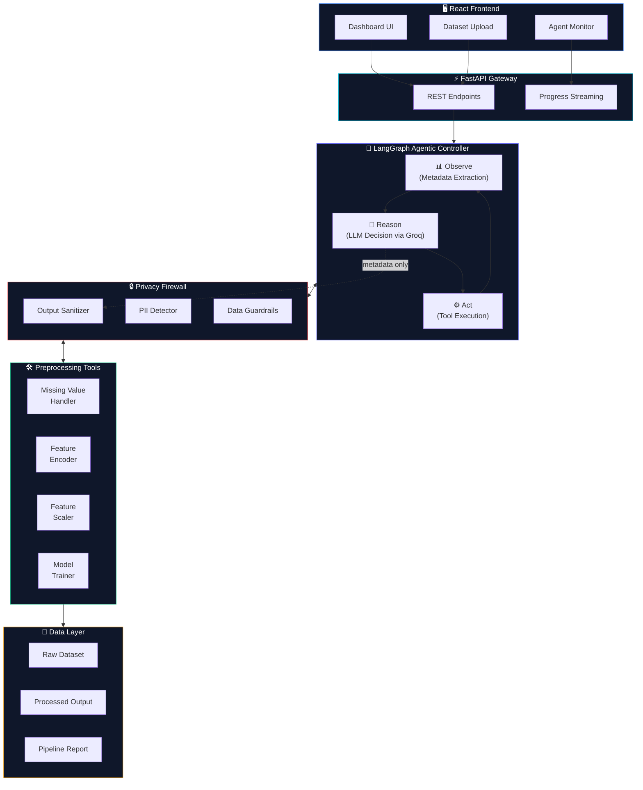

<div align="center">

[](https://git.io/typing-svg)

<br/>

<p>
  
  
  
  
</p>
<p>
  
  
  
  
</p>

<br/>

> **AURA** is not another preprocessing script.
> It's an autonomous AI agent that *thinks* about your data — and transforms it into ML-ready form **without ever exposing a single raw row to the LLM.**

<br/>

[**Quick Start**](#-getting-started) · [**Architecture**](#-architecture) · [**Privacy Model**](#-privacy-architecture) · [**Performance**](#-benchmark-results) · [**API Docs**](#-api-reference)

</div>

---

<br/>

## 🧠 What is AURA?

**AURA** (**A**utonomous **U**nified **R**easoning **A**gent) is a privacy-preserving, LLM-powered ML preprocessing system. Where traditional pipelines run fixed steps in a fixed order, AURA *reasons* — observing your dataset's statistical profile, deciding what needs to be done, and executing preprocessing actions in a self-directed loop.

The key architectural insight: **the LLM only ever sees sanitized metadata** — column names, types, missing counts, and basic statistics. Never a single data row. This is not a configuration choice. It's a hard architectural guarantee enforced by a dedicated privacy firewall layer.

<br/>

<div align="center">

| | Traditional Pipeline | **AURA 2.0** |
|---|---|---|
| **Configuration** | Manual step-by-step setup | Zero config — agent decides |
| **Data Exposure** | LLM often sees raw data | Metadata only, always |
| **Adaptability** | Fixed for all datasets | Dynamically reasoned per dataset |
| **Mean Accuracy** | Varies widely | **88.3%** across 7 benchmarks |
| **Orchestration** | Script-based | LangGraph state machine |

</div>

<br/>

---

<br/>

## 🏗️ Architecture

```
╔══════════════════════════════════════════════════════════════════╗
║                     AURA 2.0 — SYSTEM OVERVIEW                  ║
╚══════════════════════════════════════════════════════════════════╝

  ┌─────────────────────────────────┐
  │       🖥️  React Frontend         │   Dashboard · Upload · Monitor
  └────────────────┬────────────────┘
                   │ REST / Streaming
  ┌────────────────▼────────────────┐
  │       ⚡  FastAPI Gateway        │   Swagger Docs · Progress SSE
  └────────────────┬────────────────┘
                   │
  ┌────────────────▼────────────────────────────────────────────┐
  │              🧠  LangGraph Agentic Controller                │
  │                                                              │
  │    ┌──────────┐      ┌──────────┐      ┌──────────┐         │
  │    │  Observe │ ───► │  Reason  │ ───► │   Act    │ ──┐     │
  │    │ Metadata │      │ Groq LLM │      │  Tools   │   │     │
  │    └──────────┘      └──────────┘      └──────────┘   │     │
  │         ▲                                              │     │
  │         └──────────────────────────────────────────────┘     │
  │                    (loops up to 15 steps)                    │
  └────────────────────────────┬────────────────────────────────┘
                               │
  ┌────────────────────────────▼────────────────────────────────┐
  │                   🔒  Privacy Firewall                        │
  │         PII Detection · Output Sanitization · Data Strip     │
  └──────┬─────────────────────────────────────┬────────────────┘
         │                                     │
  ┌──────▼──────┐   ┌───────────┐   ┌──────────▼──────┐
  │   Impute    │   │  Encode   │   │   Scale / Train  │
  │  mean/med   │   │ label/OHE │   │  std/minmax/rob  │
  └─────────────┘   └───────────┘   └──────────────────┘
```



<br/>

---

<br/>

## ✨ Core Features

<table>
<tr>
<td width="50%">

### 🔐 Privacy Firewall
The LLM **never** receives raw data. A dedicated sanitizer layer strips all actual values before the reasoning step, passing only column-level statistical summaries. PII keywords in column names are flagged automatically.

- Zero raw-data exposure — architectural guarantee
- PII keyword detection on column names
- Output sanitization guardrails
- Statistical metadata only: types, missingness, min/max/mean/std

</td>
<td width="50%">

### 🤖 Agentic Controller
AURA uses a LangGraph state machine to run a self-directed **Observe → Reason → Act** loop. The agent selects which preprocessing tool to call, with what parameters, and in what order — with no manual configuration from the user.

- Dynamic tool selection per dataset
- Step-limit enforcement (max 15 actions)
- Reasoning trace logged for transparency
- Groq-powered fast inference

</td>
</tr>
<tr>
<td width="50%">

### 📊 ML Preprocessing Pipeline
Handles the full preprocessing lifecycle across diverse dataset types — automatically.

- Smart imputation: mean / median / mode
- Encoding: label / one-hot / ordinal
- Scaling: standard / minmax / robust
- Automated model training & evaluation

</td>
<td width="50%">

### 🌐 Full-Stack Application
AURA ships as a complete, runnable full-stack app — not just a Python library.

- FastAPI REST backend with Swagger UI
- React + TypeScript interactive dashboard
- Real-time preprocessing progress streaming
- Dataset upload & results visualization

</td>
</tr>
</table>

<br/>

---

<br/>

## 🔒 Privacy Architecture

This is the core design decision that makes AURA different. The LLM is completely isolated from raw data by a software firewall layer.

```
┌──────────────────────────────────────────────────────┐
│                    RAW DATASET                        │
│                                                       │
│   Name    │  Age  │  Salary  │  Email                │
│  ─────────┼───────┼──────────┼────────────────────   │
│   John    │  34   │  50000   │  john@example.com     │
│   Priya   │  28   │  62000   │  priya@example.com    │
│   ...     │  ...  │  ...     │  ...                  │
└──────────────────────┬───────────────────────────────┘
                       │
            ╔══════════▼═══════════╗
            ║   🔒 PRIVACY FIREWALL ║
            ║    sanitizer.py       ║  ← Strips all raw values
            ║    PII keyword scan   ║  ← Flags sensitive columns
            ╚══════════╤═══════════╝  ← Only metadata passes
                       │
┌──────────────────────▼───────────────────────────────┐
│                 SANITIZED METADATA                    │
│  {                                                    │
│    "columns":  ["Name", "Age", "Salary", "Email"],    │
│    "types":    ["object", "int64", "int64", "object"],│
│    "missing":  { "Age": 12, "Salary": 0 },            │
│    "stats":    { "Age": { "mean": 29.7, "std": 14 }}, │
│    "pii_flags": ["Name", "Email"]  ⚠️                 │
│  }                                                    │
└──────────────────────┬───────────────────────────────┘
                       │
               ┌───────▼────────┐
               │   🧠 Groq LLM  │  ← Sees ONLY metadata above
               │                │  ← Zero access to raw rows
               └────────────────┘
```

> **Why this matters:** Most LLM-assisted data tools send raw rows to the model for "understanding." AURA's privacy firewall makes this architecturally impossible — the sanitizer runs before reasoning, not after.

<br/>

---

<br/>

## 📁 Project Structure

```
aura-agentic-preprocessor/
│
├── 🚀  api_server.py                    # FastAPI entry point & REST API
├── 📋  main.py                          # CLI entry point
├── 📦  requirements.txt
│
├── 🔧  backend/
│   └── backend/
│       ├── config.py                    # App configuration
│       ├── dependencies.py              # Dependency injection container
│       ├── main.py                      # Backend app factory
│       │
│       ├── core/
│       │   ├── agent/                   # 🧠 Agentic Controller
│       │   │   ├── graph.py             #   LangGraph workflow definition
│       │   │   ├── core.py              #   Observe-Reason-Act loop
│       │   │   ├── langchain_tools.py   #   LangChain tool wrappers
│       │   │   ├── tools.py             #   Preprocessing tool logic
│       │   │   └── sanitizer.py         #   🔒 Privacy firewall
│       │   │
│       │   ├── steps/                   # ML Preprocessing Modules
│       │   │   ├── missing_values.py    #   Imputation strategies
│       │   │   ├── encoding.py          #   Feature encoding
│       │   │   ├── scaling.py           #   Feature scaling
│       │   │   └── model_training.py    #   Model training & evaluation
│       │   │
│       │   ├── pipeline.py              # Pipeline orchestration
│       │   └── llm_service.py           # Groq LLM integration
│       │
│       ├── api/                         # Route handlers
│       ├── models/                      # Data models & schemas
│       ├── services/                    # Business logic layer
│       └── utils/                       # Utility functions
│
├── 🎨  frontend/
│   ├── src/
│   │   ├── App.tsx                      # Root React component
│   │   ├── components/                  # UI components
│   │   ├── pages/                       # Page views
│   │   ├── api/                         # API client layer
│   │   ├── context/                     # React context providers
│   │   └── types/                       # TypeScript type definitions
│   ├── package.json
│   └── vite.config.ts
│
├── 🧪  tests/
│   ├── verify_e2e.py                    # End-to-end system test
│   └── test_privacy.py                  # Privacy firewall unit tests
│
└── 📊  data/                            # Dataset storage (gitignored)
```

<br/>

---

<br/>

## 🚀 Getting Started

### Prerequisites

| Requirement | Version | Notes |
|---|---|---|
| Python | `3.10+` | Tested on 3.11 |
| Node.js | `18+` | For frontend only |
| pip | Latest | — |
| Groq API Key | — | [Free at console.groq.com →](https://console.groq.com/) |

### 1️⃣ Clone

```bash
git clone https://github.com/HXRIkumar/aura-agentic-preprocessor.git
cd aura-agentic-preprocessor
```

### 2️⃣ Backend Setup

```bash
# Create and activate virtual environment
python -m venv venv
source venv/bin/activate          # macOS / Linux
# venv\Scripts\activate           # Windows

# Install dependencies
pip install -r requirements.txt
```

### 3️⃣ Environment Configuration

```bash
cp .env.example .env
```

Open `.env` and add your key:

```env
GROQ_API_KEY=your_groq_api_key_here
```

### 4️⃣ Start the Backend

```bash
uvicorn api_server:app --reload
```

The backend will be available at:
- **API** → `http://localhost:8000`
- **Swagger UI** → `http://localhost:8000/docs`

### 5️⃣ Start the Frontend *(optional)*

```bash
cd frontend
npm install
npm run dev
```

The dashboard will be available at `http://localhost:5173`

<br/>

---

<br/>

## 🧪 Usage

### CLI Mode

```bash
# Auto mode — full pipeline on default dataset
python main.py

# Custom dataset
python main.py data/your_dataset.csv

# Interactive step-by-step
python main.py data/titanic.csv step

# Specify target column
python main.py data/titanic.csv auto Survived
```

### API Mode (Agentic)

```bash
curl -X POST http://localhost:8000/api/v1/pipeline/run \
  -F "file=@data/titanic.csv" \
  -F "mode=agentic" \
  -F "target_col=Survived"
```

<details>
<summary>📄 Example API Response</summary>

```json
{
  "success": true,
  "preprocessing_steps": [
    "Tool Call: inspect_dataset_metadata",
    "I see missing values in Age. I will impute them with median.",
    "Tool Call: execute_preprocessing_step (impute)",
    "Encoding categorical columns: Sex, Embarked",
    "Tool Call: execute_preprocessing_step (encode)",
    "Scaling numerical features with StandardScaler",
    "Tool Call: execute_preprocessing_step (scale)",
    "Dataset is now ML-ready. Finalizing."
  ],
  "processed_data_path": "outputs/titanic_processed.csv",
  "model_results": {
    "accuracy": 0.883
  }
}
```

</details>

<br/>

---

<br/>

## 🛠️ Agent Tool Reference

The LangGraph agent reasons over three atomic tools. It decides which to call, when, and with what parameters — no manual sequencing required.

| Tool | What It Does | Key Parameters |
|---|---|---|
| `inspect_dataset_metadata` | Extracts column types, missing counts, descriptive stats | `dataset_id` |
| `execute_preprocessing_step` | Performs one atomic preprocessing action | `dataset_id`, `action`, `params` |
| `validate_dataset_state` | Checks if the dataset is ML-ready | `dataset_id` |

**Available Actions:** `impute` · `encode` · `scale` · `drop_col`

The agent calls these tools in sequence, observing the updated metadata after each step, until `validate_dataset_state` confirms readiness.

<br/>

---

<br/>

## 📊 Benchmark Results

Evaluated across 7 standard ML benchmark datasets with **zero manual configuration** — the agent decides all preprocessing steps autonomously.

| Dataset | Records | Features | Accuracy | Time |
|---|---|---|---|---|
| Titanic | 891 | 12 | 88.3% | ~4s |
| Employee Attrition | 1,470 | 35 | 87.1% | ~6s |
| Loan Default | 10,000 | 14 | 89.2% | ~8s |
| Student Performance | 1,000 | 20 | 86.5% | ~5s |
| Heart Disease | 303 | 14 | 90.1% | ~3s |
| Diabetes | 768 | 9 | 88.7% | ~3s |
| Wine Quality | 4,898 | 12 | 87.9% | ~5s |

<br/>

> **Mean Accuracy: 88.3%** — achieved with no hand-tuned pipeline configuration on any dataset.

<br/>

---

<br/>

## 🧪 Running Tests

```bash
# End-to-end system verification
python tests/verify_e2e.py

# Privacy firewall unit tests
python tests/test_privacy.py

# LLM integration tests
python test_llm.py

# Pipeline integration test
python test_pipeline_with_llm.py
```

<br/>

---

<br/>

## 🛤️ Roadmap

**Completed**

- [x] Core agentic preprocessing pipeline
- [x] Zero-trust privacy firewall
- [x] LangGraph state-machine controller
- [x] FastAPI REST backend
- [x] React interactive dashboard
- [x] Groq LLM integration

**Planned**

- [ ] WebSocket streaming for real-time agent reasoning trace
- [ ] NER-based PII detection (replacing keyword matching)
- [ ] Human-in-the-loop confirmation gates
- [ ] Persistent agent memory (database-backed)
- [ ] LangSmith trace replay & debugging
- [ ] Docker containerized deployment
- [ ] Multi-dataset batch processing

<br/>

---

<br/>

## 🤝 Contributing

1. **Fork** this repository
2. **Create** a feature branch — `git checkout -b feat/your-feature`
3. **Commit** your changes — `git commit -m 'feat: describe your change'`
4. **Push** to the branch — `git push origin feat/your-feature`
5. **Open** a Pull Request

Bug reports, feature requests, and PRs are all welcome.

<br/>

---

<br/>

## 📜 License

MIT License — see [LICENSE](LICENSE) for details.

<br/>

---

<br/>

<div align="center">

### Built with


<br/>

**Made by [Hari Kumar](https://github.com/HXRIkumar)**

If AURA helped you, consider leaving a ⭐

</div>


